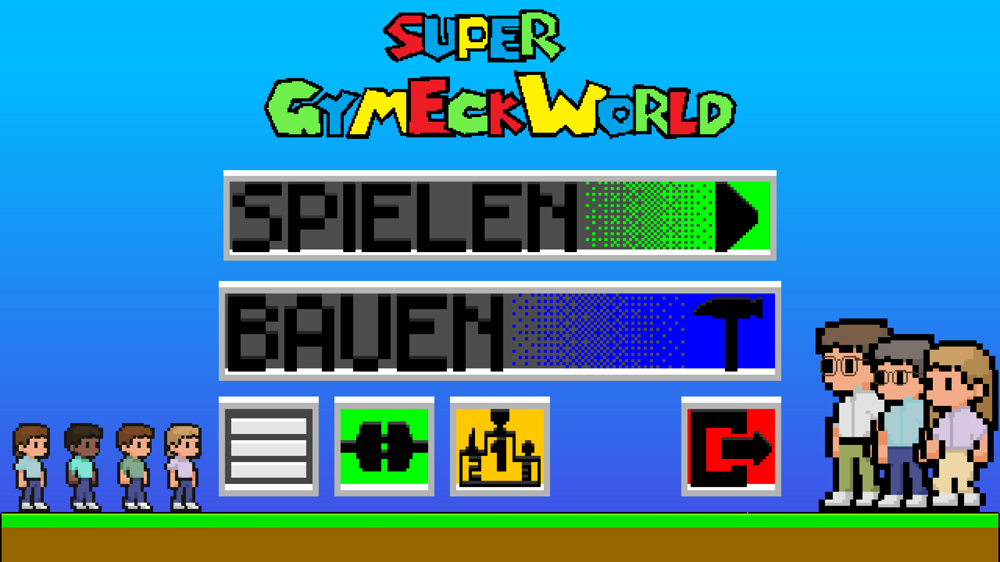
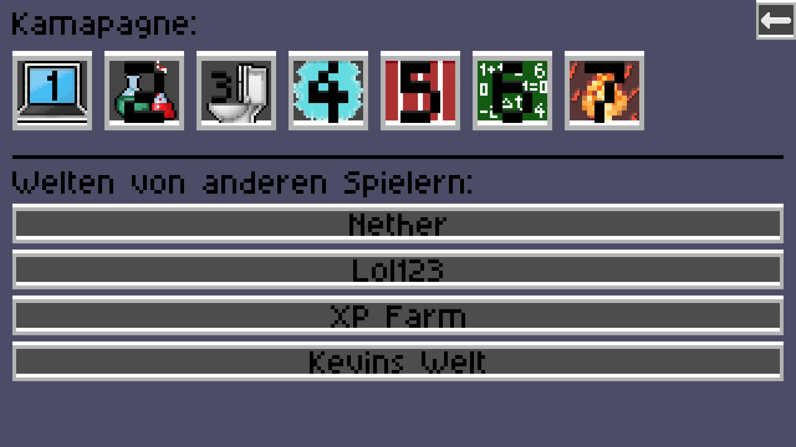
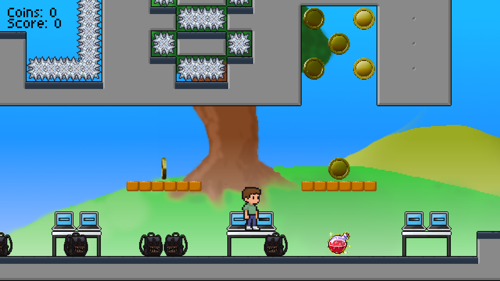
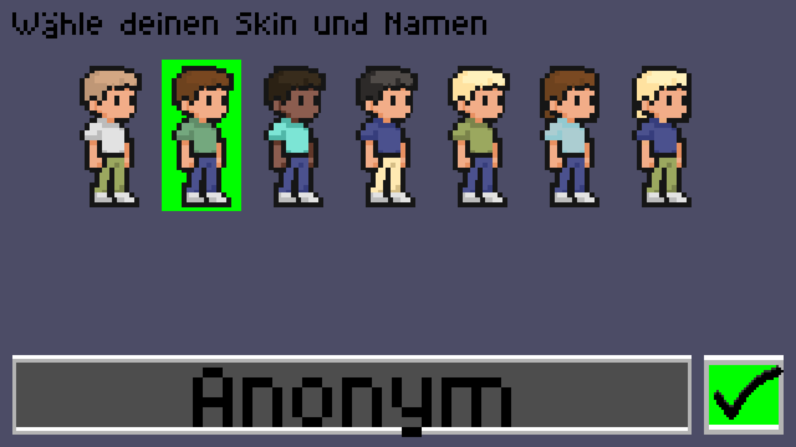
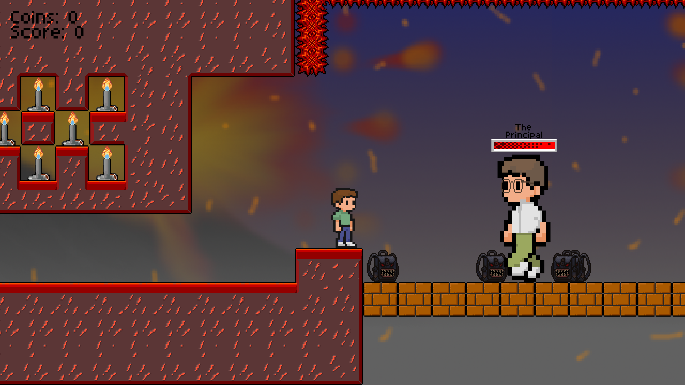
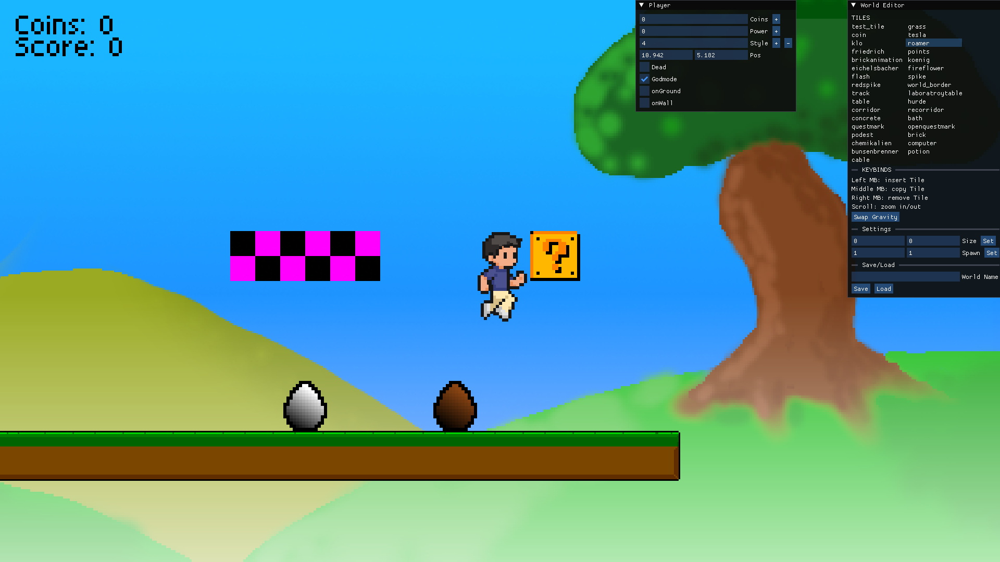

# Super GymEck World

A simple **jump-and-run** game developed for an IT class project.  
Players navigate through levels, avoid obstacles, collect items, and reach the goal.

---

## 🚀 Features

- Side-scrolling **jump & run** gameplay  
- Multiple levels  
- **Coins and items** to collect  
- Multiple **obstacles and enemies**  
- **World Creator** for building your own maps  
- Full-fledged **UI system**  
- Custom **collision** and **rendering engine**

### 🖥️ Additionally, with the Server
- Global **scoreboard**  
- **World sharing** between players  
- **Seamless reconnection** support  
- **Database integration** for persistence

---

## ⚙️ How to Run

From the root of the repository:

```bash
# On Linux / macOS
./gradlew lwjgl3:run

# On Windows
./gradlew.bat lwjgl3:run
````

To also run the **server** (if wanted):

```bash
# On Linux / macOS
docker compose up -d
./gradlew server:run

# On Windows
docker compose up -d
./gradlew.bat server:run
```

---

## 🖼️ Screenshots

|   |  |
| :----------------------------------------: |:----------------------------------------------:|
|  |  |
|  |  |
